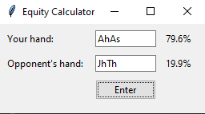

# About
This is a very simple poker equity calculator, it is currently hardcoded to run 1000 iterations based on two hands the user inputs, from which it derives the equity. This app utilizes the 'treys' poker hand evaluation library to deal with handling the deck and evaluations. This app also uses Tkinter as the GUI. This was done for the sake of learning the different technologies and this app definitely needs a few changes to become truly usable.

# Requirements
```
$ pip install treys
```
Alternatively, just run app.exe from dist to launch the calculator.

# Preview


